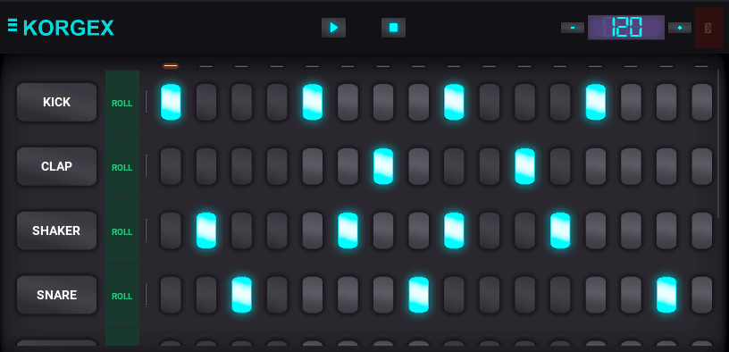
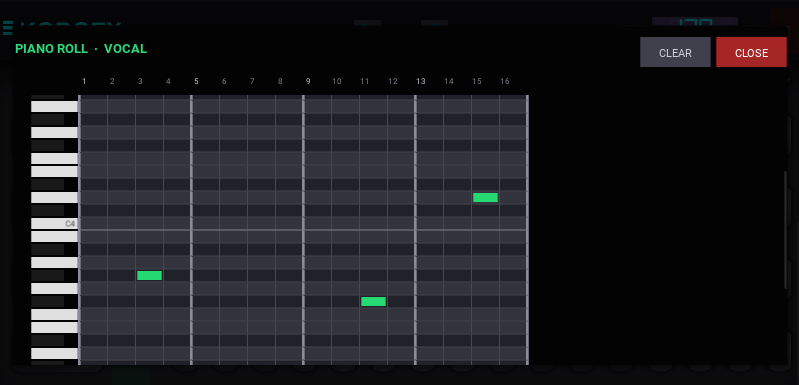

<div align="center">


# KORGEX

**Desktop Beat Machine & MIDI Sequencer**

[](https://python.org)
[](https://kivy.org)
[](https://pypi.org/project/PyAudio)
[](https://numpy.org)
[](https://microsoft.com)
[](LICENSE)

*A hardware-inspired beat machine for the desktop — 16-step sequencer, real-time mixing, and a chromatic piano roll editor.*

</div>

---

## Overview



**Korgex** is a desktop music production tool built with [Kivy](https://kivy.org) and [PyAudio](https://pypi.org/project/PyAudio). It delivers a tactile, hardware-inspired interface for building rhythmic and melodic patterns with up to **8 simultaneous sample tracks**, real-time BPM control, and a full-featured **piano roll** for note-level editing.

The interface is designed to look and feel like a piece of hardware placed directly on the screen — borderless, draggable, and always-on-top capable.

---

## Features

| | Feature | Description |
|---|---|---|
| 🥁 | **16-Step Sequencer** | Classic step-sequencer grid with 8 sample tracks |
| 🎹 | **Piano Roll Editor** | Per-track chromatic note editor (C2–B5, 48 pitches) |
| 🎚️ | **Real-time Mixing** | Low-latency PyAudio callback pipeline with 16-bit PCM mixing |
| 🎵 | **Pitch Shifting** | NumPy resampling to transpose any sample across the full chromatic scale |
| ⏱️ | **Live BPM Control** | Adjustable tempo 80–160 BPM with LCD-style display |
| 🖥️ | **Borderless UI** | Frameless hardware-style window, fully draggable from the top bar |
| 🔊 | **Sample Preview** | Click any track name to audition the sample instantly |

---

## Piano Roll



Each track features a dedicated **ROLL** button that opens the piano roll editor:

- **Click** a cell to place a MIDI note at that pitch and step position
- **Click again** on an existing note to erase it
- **Bar markers** every 4 steps for easy arrangement reading
- Notes are pitch-shifted via real-time resampling — placing a note at E4 transposes the sample a major third up from its original C4 pitch
- **CLEAR** removes all piano roll notes from the current track
- The editor scrolls vertically through all 48 pitches (C2 to B5), centered on **C4** by default

---

## Requirements

| Package | Version |
|---|---|
| Python | 3.9+ |
| Kivy | 2.3.1 |
| PyAudio | 0.2.14 |
| NumPy | 2.x |
| Pillow | any |

---

## Installation

```bash
# 1 — Clone or download the project
git clone https://github.com/yourname/korgex.git
cd korgex

# 2 — Install dependencies
pip install kivy pyaudio numpy pillow

# 3 — Launch
python main.py
```

> **Windows note:** PyAudio `0.2.14` ships pre-built wheels for Python 3.13 on Windows — no C build tools required.

---

## Controls

| Control | Action |
|---|---|
| **▶ Play** | Start the step sequencer |
| **■ Stop** | Stop playback and reset the cursor |
| **− / +** | Decrease / increase BPM by 5 |
| **Step buttons** | Toggle steps on / off for a track |
| **Track name button** | Preview the sample instantly |
| **ROLL** | Open the piano roll for that track |
| **Drag top bar** | Move the window anywhere on screen |
| **⏻** | Close the application |

---

## Architecture

```
korgex/
├── main.py                  ← App entry point, window config, layout
├── korgex.kv                ← Main Kivy layout & styles
├── track.kv                 ← Track widget styles
├── play_indicator.kv        ← Step cursor LED strip
├── audio_engine.py          ← AudioEngine factory (stream + mixer)
├── audiostream_compat.py    ← PyAudio backend (replaces mobile audiostream)
├── audio_source_mixer.py    ← Step clock + multi-track mixer
├── audio_source_track.py    ← Per-track step logic + piano roll pitch support
├── audio_source_one_shot.py ← One-shot sample preview
├── sound_kit_service.py     ← WAV sample loader
├── piano_roll.py            ← Piano roll widget, popup & pitch-shift engine
├── track.py                 ← Track widget (step buttons + ROLL button)
├── play_indicator.py        ← LED cursor widget
├── fonts/                   ← LCD font
└── sounds/kit1/             ← 8 WAV sample files
```

### Audio Pipeline

```
PyAudio output stream  (callback, 44 100 Hz / 16-bit mono)
 └── OutputStream._callback()
       └── AudioSourceMixer.get_bytes()          ← called each buffer
              ├── AudioSourceTrack[KICK ].get_bytes_array()
              ├── AudioSourceTrack[CLAP ].get_bytes_array()
              ├── AudioSourceTrack[SHAKER].get_bytes_array()
              ├── AudioSourceTrack[SNARE ].get_bytes_array()
              ├── AudioSourceTrack[BASS  ].get_bytes_array()
              ├── AudioSourceTrack[FX    ].get_bytes_array()
              ├── AudioSourceTrack[PLUCK ].get_bytes_array()
              └── AudioSourceTrack[VOCAL ].get_bytes_array()
              → sum_16bits() clamp mix → PCM bytes → speakers
```

Each `AudioSourceTrack` checks, for the current step:
1. **Piano roll note** → play pitch-shifted sample (NumPy resampling)
2. **Step button active** → play original sample
3. **Neither** → silence (with tail continuation from previous trigger)

---

## Sample Kit

| Track | File | Type |
|---|---|---|
| KICK | `sounds/kit1/kick.wav` | Drum |
| CLAP | `sounds/kit1/clap.wav` | Drum |
| SHAKER | `sounds/kit1/shaker.wav` | Percussion |
| SNARE | `sounds/kit1/snare.wav` | Drum |
| BASS | `sounds/kit1/bass.wav` | Melodic |
| EFFECTS | `sounds/kit1/effects.wav` | FX |
| PLUCK | `sounds/kit1/pluck.wav` | Melodic |
| VOCAL | `sounds/kit1/vocal_chop.wav` | Vocal |

All samples are loaded as **16-bit signed PCM** via Python's built-in `wave` module. The assumed recording pitch for pitch shifting is **C4 (MIDI 60)**.

---

## License

MIT © 2024 — Built with Kivy, PyAudio & NumPy.
# Korgex
